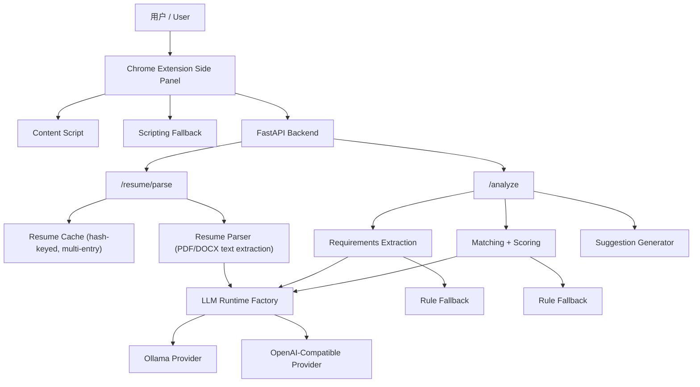
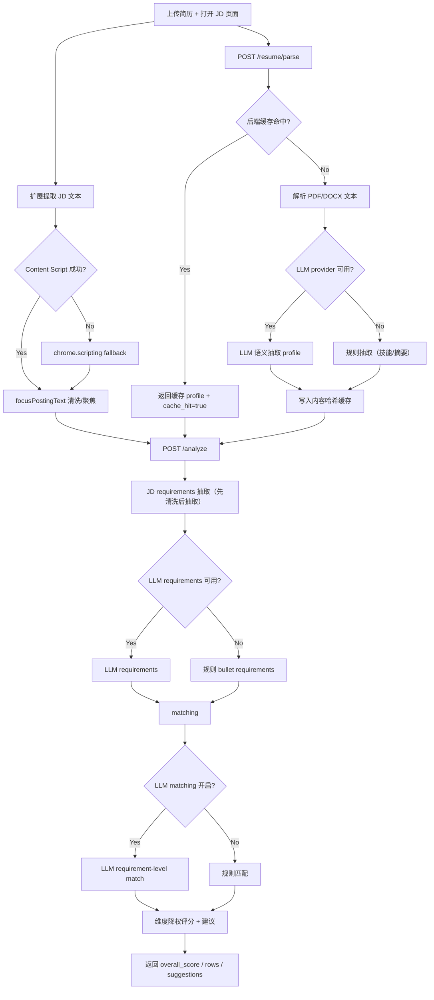
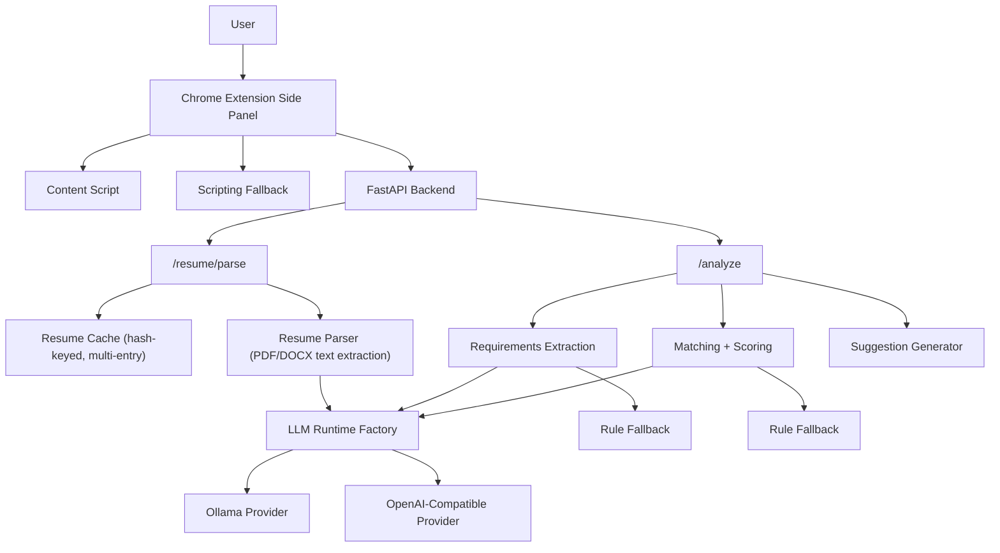
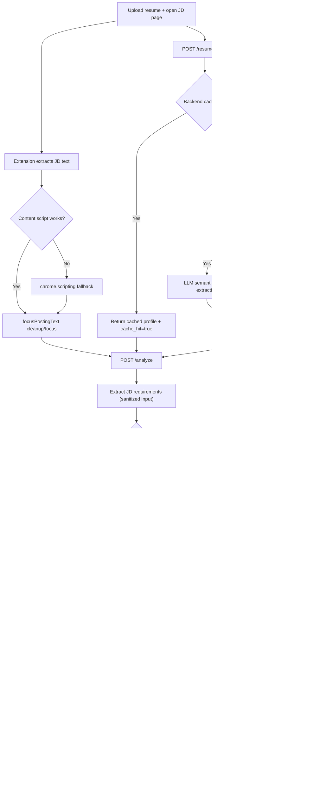

# Current Architecture & Flow / 当前架构与流程

## 中文

### 架构图（核心组件）

### 流程图（一次分析请求）

### 核心机制细节

- 统一 LLM 入口：`backend/src/hound_core/llm_runtime.py`。
- Provider 选择：`HOUND_LLM_PROVIDER=rule|ollama|openai|auto`。
- 统一 API 形态：OpenAI-compatible chat/completions；本地 LLM（如 Ollama）也走 API。
- 简历缓存：按文件内容 SHA-256；多条目（默认 8，`HOUND_RESUME_CACHE_MAX_ENTRIES`）。
- JD 聚焦：优先 `Overview/Responsibilities/Qualifications`，截断 `About the company/More jobs` 等噪声段。
- 评分口径：`technical=1.0`、`soft=0.45`、`compliance=0.2`、`other=0.65`；`unknown` 不计分母。

---

## English

### Architecture Diagram (Core Components)

### Flow Diagram (Single End-to-End Analysis)

### Core Mechanisms

- Unified LLM runtime entry: `backend/src/hound_core/llm_runtime.py`.
- Provider switch: `HOUND_LLM_PROVIDER=rule|ollama|openai|auto`.
- Unified API style: OpenAI-compatible chat/completions; local LLM APIs are treated similarly.
- Resume cache: SHA-256 content hash, bounded multi-entry cache (`HOUND_RESUME_CACHE_MAX_ENTRIES`, default 8).
- JD focus extraction: keeps requirement sections and removes company/promotional noise sections.
- Scoring: dimension multiplier (`technical=1.0`, `soft=0.45`, `compliance=0.2`, `other=0.65`); `unknown` excluded from denominator.
